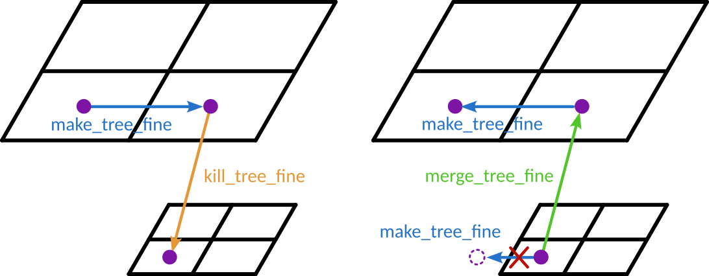
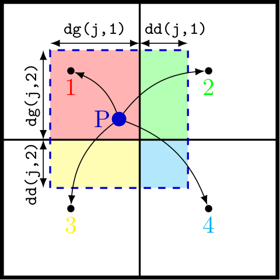
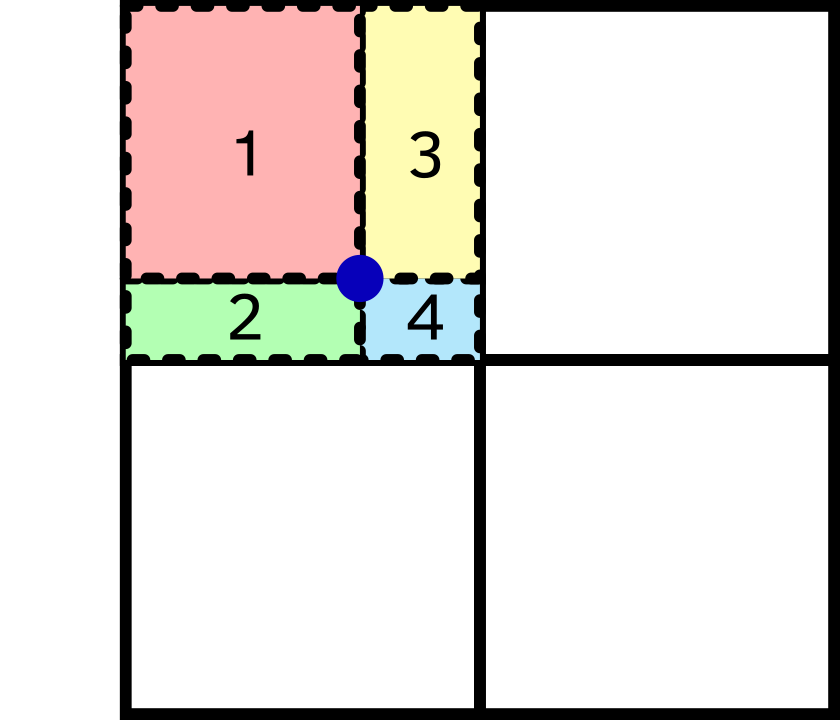
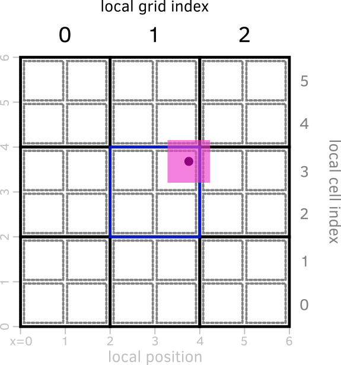

Particles
==================

In this chapter, we will cover the implementation of particles in RAMSES, namely:

- How particles are represented in the code
- How we can we navigate the list of particles in the code
- How particles interact with the grid

.. contents::

1. Particles implementation in RAMSES
-------------------------------------

1.1 Particle arrays
~~~~~~~~~~~~~~~~~~~

The core of the particle-related code is stored in the ``pm`` folder, where PM stands for "particle-mesh" (i.e., the part of the code responsible for interactions between the particles and the mesh). As for other parts of the code, the majority of the important variables are stored in a *commons* module. For the particles, the module is ``pm_commons``, found in ``pm/pm_commons.f90``. Additional variables are stored in the corresponding ``pm_parameters`` module, located in ``pm/pm_parameters.f90``.

Most quantities related to particles are stored in large **global arrays**, with in general one variable per array. The size of these arrays is fixed by the maximum number of particles allowed for the run, set by the parameter ``npartmax`` defined in the ``pm_parameters`` module. We will cover how to set this parameter in :doc:`the section on the namelist <parameters>`. Just like ``ngridmax`` for the grids, the number of particles can either be set directly through ``npartmax`` (which sets the maximum number of particles *per MPI process*), or through the *total* number of particles across all MPI processes, ``nparttot``.
These two are related through ``nparttot = npartmax*ncpu``.

.. warning::

   It is usually more convenient to work with ``npartmax`` when developing code, as it is the actual size of the arrays available for each MPI process. However, when running a simulation with a fixed number of particles (e.g., a dark matter-only simulation), ``nparttot`` might be more convenient.

The particle masses are stored in the ``mp`` variable, which is a one-dimensional array of size ``npartmax``. The positions and velocity are stored in ``xp`` and ``vp``, respectively: these are two-dimensional arrays, with size ``(npartmax, ndim)`` where ``ndim`` is the number of dimensions (usually ``ndim=3``). Similar arrays exist for the birth time, the metallicity, or the AMR level at which the particles are living.

All these arrays are defined in ``pm/pm_commons.f90``:

.. code:: fortran

     ! Particles related arrays
     real(dp),allocatable,dimension(:,:)  ::xp       ! Positions
     real(dp),allocatable,dimension(:,:)  ::vp       ! Velocities
     real(dp),allocatable,dimension(:)    ::mp       ! Masses
     ...
     real(dp),allocatable,dimension(:)    ::tp       ! Birth epoch
     real(dp),allocatable,dimension(:)    ::zp       ! Birth metallicity
     ...
     integer ,allocatable,dimension(:)    ::levelp   ! Current level of particle

1.2 Different types of particles
~~~~~~~~~~~~~~~~~~~~~~~~~~~~~~~~

While RAMSES was originally (`Teyssier, 2002 <https://ui.adsabs.harvard.edu/abs/2002A%26A...385..337T/abstract>`__) designed to work with only DM particles, the code was quickly extended to star formation, galactic winds, black holes, etc. All these developments have relied, to some extent, on "particles": for example, stars are modelled as particles representing a stellar population with a unique age and metallicity.

In practice, the choice in RAMSES is that all these "particles" are implemented using the same global arrays: ``xp`` for positions, ``mp`` for mass, etc. However, this requires some adjustments to identify which particle correspond to what type of thing. For example, some physical models such as supernova explosions only apply to star particles, and we therefore need a simple way to identify which particles corresponds to stars, and which don't.

Since 2017, RAMSES implements these as *particle types* (similar, for example, to Gadget/AREPO particle *types*), stored in the ``typep`` array. Contrary to other arrays we have seen so far, ``typep`` is not an *simple* array with real/integer values, instead it is an array of ``part_t``, a *derived type* that contains two variables, defined at the end of ``pm/pm_parameters.f90``:

- a ``family`` variable
- a ``tag`` variable

The ``typep`` variable is defined in ``pm/pm_commons.f90``:

.. code:: fortran

     type(part_t), allocatable, dimension(:) :: typep  ! Particle type array

and the type itself is defined in ``pm/pm_parameters.f90``:

.. code:: fortran

     type part_t
        ! We store these two things contiguously in memory
        ! because they are fetched at similar times
        integer(1) :: family
        integer(1) :: tag
     end type part_t

The ``family`` variable stores what the particle represent:

+----------------+-------+-------------------------------------------------------------+
| Family         | Value | Physical meaning                                            |
+================+=======+=============================================================+
| ``FAM_DM``     | 1     | DM particle                                                 |
+----------------+-------+-------------------------------------------------------------+
| ``FAM_STAR``   | 2     | Star particle                                               |
+----------------+-------+-------------------------------------------------------------+
| ``FAM_CLOUD``  | 3     | "Cloud" particle, used for some black-hole implementations  |
+----------------+-------+-------------------------------------------------------------+
| ``FAM_DEBRIS`` | 4     | "Debris" particle, used for some supernovae implementations |
+----------------+-------+-------------------------------------------------------------+
| ``FAM_OTHER``  | 5     | "Other" type of particle, defined as a catch-all value      |
+----------------+-------+-------------------------------------------------------------+
| ``FAM_UNDEF``  | 127   | Used for "undefined" type, internally                       |
+----------------+-------+-------------------------------------------------------------+

In addition, six other values are used for *tracer* particles, mirroring values in the table above (e.g., ``-1`` for DM tracers, ``-2`` for star tracers, etc), as well as a ``FAM_TRACER_GAS=0`` value for gas tracer particles.

The particle tags are currently not commonly used, but allow flexibility to have different types of *the same kind* of particles. For example, one could decide to have Pop III stars and normal Pop II stars implemented at the same time: both would be considered as *stars* by the code (``FAM_STAR`` family), but still identified independently with their own tag. This can be useful either for post-processing (e.g., "make a map of all Pop III stars"), or even for specific physical models (e.g., Pop III stars could have a different radiative output or stellar evolution model).

In practice, rather than testing directly the ``typep`` value of a particle, the best practice is to use the *functions* defined at the end of the ``pm_commons`` module to test whether a particle is of a given type. For example, the ``is_star`` function returns ``True`` if the particle is a star, and ``False`` otherwise. This allows more concise code, as we can write multiple tests in one function. For example, ``is_tracer`` returns ``True`` if a particle is a tracer particle, *irrespective of what kind of tracer*.

NB: when implementing new types of particles, make sure to use the right ``family`` (if one already exists), use or define the appropriate ``tag``, and (if necessary) add the right tester function.

1.3 Initialising particles
~~~~~~~~~~~~~~~~~~~~~~~~~~

In the code, the global particle arrays are *defined* in the ``pm_commons`` module, but are not *allocated* there: indeed, ``npartmax`` is a runtime parameter, so it cannot be fixed once and for all in the code.

Instead, all the particle-related arrays are allocated when the simulation is initialised, in the ``init_part`` routine, defined in ``pm/init_part.f90``. This is done through the following code:

.. code:: fortran

     ! Allocate particle variables
     allocate(xp    (npartmax,ndim))
     allocate(vp    (npartmax,ndim))
     allocate(mp    (npartmax))

By default, all these arrays are set to 0 prior to proper initialisation. Then, depending on whether the code is starting from initial conditions or re-starting from a previous output, the variables are set to the right values.

When **starting from initial conditions**, three formats are supported by default: ASCII files, GRAFIC files, and GADGET files. We will not cover the inner details of each of these formats, but the corresponding subroutines (``load_ascii``, ``load_grafic``, and ``load_gadget``) can all be found in ``pm/init_part.f90``. The easiest to understand is ``load_ascii``, but they all work in similar ways:

#. we read the input file header to deal with units, box size, etc
#. we read all arrays in the input file and count the number of particles
#. (we communicate information across MPI processes)
#. while iterating over particles, we fill the global arrays (``xp``, ``vp``, ``mp``, etc).

.. admonition:: **Exercise**

   Can you explain how the ``load_ascii`` and ``load_grafic`` subroutines work? For example, can you identify where the positions are read, and where they are set in the ``xp`` array?

In the case of a **restart**, the process is roughly the same, except that each MPI process opens the corresponding file from the last output. For example, if we restart from output 42, the MPI process 37 will open the file ``output_00042/part_00042.out00037``.

.. warning::

   This strategy to initialise the data at restart is part of the reason why RAMSES enforces that the number of MPI processes stays identical when restarting a simulation.

.. admonition:: **Exercise**

   Identify where, in ``init_part.f90``, the particle output files are opened.

   .. admonition:: **Solution**
      :class: dropdown

      Look around ``if(nrestart>0) then``:

      .. code:: fortran

	 call title(nrestart,nchar)
	 fileloc='output_'//TRIM(nchar)//'/part_'//TRIM(nchar)//'.out'
	 ...
	 call title(myid,nchar)
	 fileloc=TRIM(fileloc)//TRIM(nchar)
	 ...
	 open(unit=ilun,file=fileloc,form='unformatted')

      The ``title`` function transforms the output number ``nrestart`` or the MPI process ID ``myid`` to a string padded with five ``0``.

Once the file is open, we first read a header and then, each array stored in the output will be read. For example, the positions are read as:

.. code:: fortran

        ! Read position
        allocate(xdp(1:npart2))
        do idim=1,ndim
           read(ilun)xdp
           xp(1:npart2,idim)=xdp
        end do

Let's explain how these lines work. First, we allocate a temporary array (``xdp``) with size ``npart2`` corresponding to the number of particles *in the file*. Then, for each dimension, we read the position from the file to the array ``xdp``, and we fill the position array ``xp`` with the array we just read.

Note that we use and re-use several temporary arrays (``xdp``, ``isp8``, ``isp``, ``ii1``), each corresponding to a data type.

.. warning::

   **Careful:** if you change the output format for the particles, you will need to change the section of ``init_part.f90`` that deals with restarts.

2. Navigating particle arrays with linked lists
-----------------------------------------------

Because of the AMR structure of RAMSES, we need to store particles in a structure that can efficiently be connected to the grid. As the grid evolves with time, this structure also needs to evolve with time. The "natural" solution for this is to use a linked-list for the particles, just like what is done for the grid.

The key idea here is that particles living in the same grid are linked together with a linked-list that is defined *per-grid*, and we use the grid structure with its own linked list to connect all the particles together.

As this leads to a tree structure, the bulk of the code dealing with the particle list is in the aptly named ``pm/particle_tree.f90`` file.

2.1 Particle linked list structure
~~~~~~~~~~~~~~~~~~~~~~~~~~~~~~~~~~

In each grid, we have a particle linked list defined using the following variables, defined in ``pm/pm_commons.f90``:

.. code:: fortran

     integer ,allocatable,dimension(:)    ::headp    ! Head particle in grid
     integer ,allocatable,dimension(:)    ::tailp    ! Tail particle in grid
     integer ,allocatable,dimension(:)    ::numbp    ! Number of particles in grid

They are allocated in the ``init_amr`` subroutine (in ``amr/init_amr.f90``), if the run parameter flag ``pic`` (particle in cell) is set:

.. code:: fortran

   if(pic)then
      allocate(headp(1:ngridmax))
      allocate(tailp(1:ngridmax))
      allocate(numbp(1:ngridmax))
      headp=0; tailp=0; numbp=0
   endif

Note that if ``pic`` is *not* set, there are no particles, so we don't have to do any of this.

As required for a linked list, for each particle the next and previous particle in the list is stored. These arrays are defined in ``pm/pm_commons.f90``:

.. code:: fortran

     integer ,allocatable,dimension(:)    ::nextp    ! Next particle in list
     integer ,allocatable,dimension(:)    ::prevp    ! Previous particle in list

They are allocated in ``pm/init_part.f90``:

.. code:: fortran

     allocate(nextp (npartmax))
     allocate(prevp (npartmax))

One specificity of particles is that they can move freely through the AMR grid: they can enter and exit cells during a timestep, and (because of the timestepping strategy), they can move to grids that live on different timesteps.

Dealing with this requires careful consideration, and the subroutines dealing with this are found in ``pm/particle_tree.f90``, with the most important one being ``make_tree_fine``. It essentially detaches particles that have moved from their original parent grid, and reattaches them to the grid in which they are now located.

Similarly, when a grid is refined or derefined, special care needs to be taken of the particles: the routines doing this are, respectively, ``kill_tree_fine`` and ``merge_tree_fine``.

Finally, when particles move across processor boundaries (see the :doc:`section on MPI communications <mpi>`), the routine ``virtual_tree_fine`` deals with the linked list structure.

2.2 Iterating over particles
~~~~~~~~~~~~~~~~~~~~~~~~~~~~

The *particle* and *grid* linked lists structures are used to iterate over particles.

The following code block represents the usual way of looping over all particles in a given MPI process:

.. code:: fortran

     do icpu=1,ncpu
     ! Loop over cpus
        igrid=headl(icpu,ilevel)
        ! Loop over grids
        do jgrid=1,numbl(icpu,ilevel)
           npart1=numbp(igrid)  ! Number of particles in the grid
           if(npart1>0)then
              ipart=headp(igrid)
              ! Loop over particles
              do jpart=1,npart1
                 ! Save next particle   <--- Very important !!!
                 next_part=nextp(ipart)

                 !----
                 ! Do something with particle ipart
                 !----

                 ipart=next_part  ! Go to next particle
              end do
           endif
           igrid=next(igrid)   ! Go to next grid
        end do
     end do

Let's unravel this and start from the ``igrid = headl(icpu, ilevel)`` line. This initialises the variable ``igrid`` to the index of the first element of the list of *grids* at the current level ``ilevel``.

Then, the section

.. code:: fortran

   do jgrid=1, numbl(icpu, ilevel)
       npart1=numbp(igrid)
       ...
       igrid=next(igrid)
   end do

loops over all grids at the current level. The variable ``npart1=numbp(igrid)`` stores the number of particles that exist in grid indexed by ``igrid``. Note here that when we first enter the loop, ``igrid`` is defined from the ``headl`` access, but at the end of the loop, we go to the next grid in the list, determined by ``next(igrid)``.

If there is at least one particle in the grid (i.e., if ``npart1>0``), we can loop over the particles in the grid with the particle linked-list:

.. code:: fortran

   ipart=headp(igrid)
   do jpart=1,npart1
       next_part=nextp(ipart)
       ...
       ipart=next_part
   end do

This is done in many places in the code, and looking for the ``Very important !!!`` comment is likely to return many of these places. You can guess how people usually go about writing this loop.

2.3 The different particle tree operations
~~~~~~~~~~~~~~~~~~~~~~~~~~~~~~~~~~~~~~~~~~~

Before looking at the individual operations, it helps to state the invariant that
the whole scheme rests on:

.. important::

   Every slot of the particle arrays, from ``1`` to ``npartmax``, belongs (in principle) to
   **exactly one** linked list at any time: either the list of a grid, or the
   list of *unused* slots, called the **free list**.

The free list uses the same ``nextp``/``prevp`` arrays as the grid lists, with its
own head, tail and counter, defined in ``pm/pm_commons.f90``:

.. code:: fortran

     integer::headp_free,tailp_free,numbp_free=0,numbp_free_tot=0

It is the memory allocator for particles: "creating" a particle never allocates
anything, it simply takes a slot off the free list, and "destroying" one gives
its slot back. The number of particles actually in use is therefore just the
complement of the free list, which is why you will find this line every time the
free list changes:

.. code:: fortran

   npart=npartmax-numbp_free

Four primitives, defined in ``pm/add_list.f90`` and ``pm/remove_list.f90``, are all
that is needed to manipulate the lists. They all work on batches of up to
``nvector`` particles, and most take a mask ``ok`` so that only a subset of the
batch is acted on:

+-------------------+------------------------------------------------------------------+
| Primitive         | Effect                                                           |
+===================+==================================================================+
| ``remove_list``   | Unlink particles from the list of the grid they are in           |
+-------------------+------------------------------------------------------------------+
| ``add_list``      | Append particles at the **tail** of the list of a grid           |
+-------------------+------------------------------------------------------------------+
| ``remove_free``   | Take slots off the **head** of the free list and return their    |
|                   | indices to the caller                                            |
+-------------------+------------------------------------------------------------------+
| ``add_free``      | Reset all particle data and append the slots at the tail of the  |
|                   | free list (``add_free_cond`` does the same behind a mask)        |
+-------------------+------------------------------------------------------------------+

Note the asymmetry between the two "remove" routines: ``remove_list`` is told
*which* particles to unlink, whereas ``remove_free`` *chooses* the slots and hands
them back through an ``intent(out)`` argument. That difference matters later.

Because of the invariant above, the golden rule is:

.. warning::

   A particle must never be on two lists, nor on none. Every operation is
   therefore a **pair**: one routine that takes the particle off a list,
   followed by one that puts it on another. Always remove before adding.

Almost everything the code does to particles is built from those primitives. There are
several situations to handle, and it is worth seeing them side by side:

+---------------------------------------+---------------------------------------+-------------------------------------+
| Operation                             | Where it is handled                   | Primitives used                     |
+=======================================+=======================================+=====================================+
| Particle drifts to a sister grid at   | ``make_tree_fine`` → ``check_tree``   | ``remove_list`` + ``add_list``      |
| the same level                        |                                       |                                     |
+---------------------------------------+---------------------------------------+-------------------------------------+
| Grid is refined: particle moves from  | ``kill_tree_fine`` → ``kill_tree``    | ``remove_list`` + ``add_list``      |
| ``ilevel`` down to ``ilevel+1``       |                                       |                                     |
+---------------------------------------+---------------------------------------+-------------------------------------+
| All particles of ``ilevel+1`` are     | ``merge_tree_fine``                   | *none* — merges whole lists         |
| gathered back into ``ilevel``         |                                       | directly (see below)                |
+---------------------------------------+---------------------------------------+-------------------------------------+
| Particle leaves this MPI process      | ``virtual_tree_fine`` → ``fill_comm`` | ``remove_list`` + ``add_free``      |
+---------------------------------------+---------------------------------------+-------------------------------------+
| Particle arrives from another process | ``virtual_tree_fine`` → ``empty_comm``| ``remove_free`` + ``add_list``      |
+---------------------------------------+---------------------------------------+-------------------------------------+
| Particle is created                   | ``star_formation``, ``sink_particle`` | ``remove_free`` + ``add_list``      |
+---------------------------------------+---------------------------------------+-------------------------------------+
| Particle is destroyed                 | ``feedback``, ``sink_particle``       | ``remove_list`` + ``add_free_cond`` |
+---------------------------------------+---------------------------------------+-------------------------------------+

.. note::

   The names of some of these routines can seem a bit cryptic:

   - ``make_tree_fine`` **makes** the fine-level tree, i.e. rebuilds which grid
     each particle belongs to after they have moved.
   - ``kill_tree_fine`` **kills** the existing ``ilevel+1`` lists — it resets
     them all before refilling them from ``ilevel``.
   - ``merge_tree_fine`` **merges** the ``ilevel+1`` lists back into the
     ``ilevel`` ones, which as we saw is literally a list splice.

``check_tree`` and ``kill_tree`` both use the same pair
of calls (``remove_list`` + ``add_list``), only the source and destination differ.

.. admonition:: **Exercise**

   Why does ``merge_tree_fine`` not use the primitives?

   .. admonition:: **Solution**
      :class: dropdown

      Because it gathers *every* particle of a child grid into its father, it can 
      simply hook the two linked lists together in one operation, instead of moving particles one by one:

      .. code:: fortran

         ! Connect son linked list at the tail of father linked list
         nextp(tailp(ind_grid(i)))=headp(ind_grid_son(i))
         prevp(headp(ind_grid_son(i)))=tailp(ind_grid(i))
         numbp(ind_grid(i))=numbp(ind_grid(i))+numbp(ind_grid_son(i))
         tailp(ind_grid(i))=tailp(ind_grid_son(i))

      This is the whole point of using a linked list rather than an array: splicing two
      lists is O(1), so the cost of ``merge_tree_fine`` scales with the number of
      *grids*, not the number of *particles*.

The different use cases of these routines are explained in more detail below.

2.4 Where all this happens in ``amr_step``
~~~~~~~~~~~~~~~~~~~~~~~~~~~~~~~~~~~~~~~~~~

The routines above are called in a specific order in ``amr_step``, listed below.

+---------------------------+---------------------------------------------------------------+
| Routine                   | What it does to the particles                                 |
+===========================+===============================================================+
| ``refine_fine``           | Creates and destroys grids. Ordinary particles need **no**    |
|                           | handling here — see the note below. MC tracers are the        |
|                           | exception.                                                    |
+---------------------------+---------------------------------------------------------------+
| ``make_tree_fine``        | Re-attaches particles that drifted out of their grid during   |
|                           | the previous step, to the correct grid **at this level**.     |
+---------------------------+---------------------------------------------------------------+
| ``rho_fine``              | CIC deposition: particles contribute their mass to ``rho``.   |
|                           | Reads the lists, does not modify them.                        |
+---------------------------+---------------------------------------------------------------+
| ``kill_tree_fine``        | Hands particles that sit in refined regions down to           |
|                           | ``ilevel+1``, so the finer level owns them for its sub-steps. |
+---------------------------+---------------------------------------------------------------+
| ``virtual_tree_fine``     | Sends particles that have left this MPI domain to their new   |
|                           | process, and receives incoming ones.                          |
+---------------------------+---------------------------------------------------------------+
| ``synchro_fine``          | Gravitational kick: updates particle positions and velocities |
|                           | from the force field (part 1).                                |
+---------------------------+---------------------------------------------------------------+
| *recursive* ``amr_step``  | The finer level runs its own (sub-)steps, with the particles  |
| ``(ilevel+1)``            | that ``kill_tree_fine`` just gave it.                         |
+---------------------------+---------------------------------------------------------------+
| ``move_fine``             | Updates particle positions and velocities (part 2).           |
+---------------------------+---------------------------------------------------------------+
| ``star_formation``        | Creates new particles (and ``feedback`` may destroy some).    |
+---------------------------+---------------------------------------------------------------+
| ``merge_tree_fine``       | Takes every particle back from ``ilevel+1`` into ``ilevel``,  |
|                           | so this level owns them all again when it next runs.          |
+---------------------------+---------------------------------------------------------------+

The pairing worth remembering is ``kill_tree_fine`` … ``merge_tree_fine``: they
bracket the recursion. The coarse level lends its particles to the fine level
before recursing, and takes them all back afterwards.

Remark that this means that particles need no special attention when refining/derefining grids.
The only place in ``amr/refine_utils.f90`` that touches the
particle lists is in ``kill_grid``:

.. code:: fortran

   if(pic)then
      do i=1,nn
         headp(ind_grid_son(i))=0
         tailp(ind_grid_son(i))=0
         numbp(ind_grid_son(i))=0
      end do
   end if

which merely resets the list of the grid being freed, so that the slot is clean
when it is reused. No particle is moved, because by the time ``refine_fine`` runs
there are no particles attached to the grids being destroyed: ``merge_tree_fine``
lifted them all up to ``ilevel`` at the end of the previous step.

.. note::

   MC tracers are the exception. They are attached to *cells* rather than merely
   parked in a grid list, so when a cell is refined its tracers have to be
   distributed among the new children, with a probability proportional to the
   child masses. This is done by ``post_make_grid_fine_hook`` and its
   counterparts in ``pm/tracer_utils.f90``, called from ``refine_fine``.

.. important::

   The child grids are **not** disconnected in ``merge_tree_fine``. ``headp``,
   ``tailp`` and ``numbp`` of the child are never reset, so after the splice
   they still describe exactly the run of particles that came from that child.
   This stays true however many times that run is spliced further up the
   hierarchy, because splicing only rewrites the links at the join and leaves
   the interior of the chain untouched. The child head and count therefore
   remain a valid record of "the particles that were in this grid" long after
   the particles themselves have been merged several levels above.

   This mechanism is relied on my the MC tracer particles. When a grid is derefined,
   ``pre_kill_grid_hook`` in ``pm/tracer_utils.f90`` walks ``headp``/``numbp``
   of the doomed grid to find its gas tracers, recentre them on the parent cell
   and update ``partp``.
   By the time ``refine_fine`` runs, the particles live in a grid several
   levels up, so this dangling record is the only thing that still identifies
   which tracers belonged to the doomed grid.
   Note that this is fragile and probably not intended to be used this way.

   The lists are cleared by the "Reset all linked lists at level ilevel+1" loop
   at the top of ``kill_tree_fine``, once the derefinement pass is over.

2.5 Moving particles between grids
~~~~~~~~~~~~~~~~~~~~~~~~~~~~~~~~~~

We can distinguish several cases when a particle moves to a neighbouring region.

The simplest case is when the neighbouring region is at **the same refinement level**.
This is handled by ``make_tree_fine``, which works out which of
the :math:`3^{\texttt{ndim}}` neighbouring grids the 
particle now sits in, and moves it there.

It gets more complex when the target region is **at a different refinement level**.
``make_tree_fine`` never moves a particle across levels.
It looks up the neighbouring *father*
cells at ``ilevel-1``, and then takes their children:

.. code:: fortran

     igrid_son(j)=son(nbors_father_cells(ind_grid_part(j),ind_son(j)))

so the destination is by construction a grid at ``ilevel``. As a result,
``make_tree_fine`` needs to be combined with another routine to obtain the
desired result. The two cases are:

- the neighbouring region is **more refined**: the father cell is refined, ``son``
  returns a valid grid at ``ilevel``, and the particle moves there normally using
  ``make_tree_fine``. It is
  then pushed further down to ``ilevel+1`` by ``kill_tree_fine``, which runs later
  in ``amr_step``.
- the neighbouring region is **less refined**: the father cell has no child, so
  ``son`` returns ``0``, ``ok(j)`` is set to ``.false.`` and the particle is left
  attached to its original grid — even though it is now geometrically outside it.
  The particle is not stranded by this. At the end of ``amr_step(ilevel-1)``,
  ``merge_tree_fine`` pulls *every* particle of level ``ilevel`` up to
  ``ilevel-1``, and the next ``make_tree_fine(ilevel-1)`` then relocates it among
  the neighboring grids at a lower level, where the destination does exist.

   The two cases, with the coarse level drawn above the fine level. **Left:** the
   particle drifts into a region that is refined. ``make_tree_fine`` moves it
   within the coarse level to the grid that now covers it, and ``kill_tree_fine``
   then hands it down to the fine level. **Right:** the particle drifts towards a
   region that is *not* refined. ``make_tree_fine`` cannot move it at the fine
   level, because the neighbouring grid it would need does not exist (red cross),
   so the particle stays where it is until ``merge_tree_fine`` lifts it back up
   to the coarse level — where ``make_tree_fine`` can finally place it in the
   correct grid.

There is a hard limit on how far a particle may drift in a single step. If
it has left the :math:`3^{\texttt{ndim}}` neighbourhood of its parent grid,
``check_tree`` cannot express where it went, and the code stops:

.. code:: fortran

   if(error)then
      write(*,*)'Problem in check_tree at level ',ilevel
      write(*,*)'A particle has moved outside allowed boundaries'
      ...
      stop
   end if

This is the meaning of the sentence in the header of ``make_tree_fine``,
*"Particles must not move to a distance greater than direct neighbors
boundaries"*, and it is what the particle timestep condition (in
``pm/newdt_fine.f90``) exists to guarantee.

2.6 Moving particles between MPI processes
~~~~~~~~~~~~~~~~~~~~~~~~~~~~~~~~~~~~~~~~~~

This one is worth reading carefully, because it is really a *destruction* on one
process and a *creation* on another. On the
sending side ``fill_comm`` copies the particle data into a communication buffer,
unlinks the particle from its grid and returns the slot to the free list — from
that process's point of view the particle has ceased to exist. On the receiving
side ``empty_comm`` claims a fresh slot from the free list, unpacks the buffer
into it and links it into the destination grid. The particle index is therefore
**not** preserved across the transfer, which is why particles carry a separate
identity (``idp``) that does survive.

2.7 Creating and destroying particles
~~~~~~~~~~~~~~~~~~~~~~~~~~~~~~~~~~~~~

**Creating.** Star formation is the archetype: ``remove_free`` first, to obtain
slots, then fill in the particle data, then ``add_list`` to attach them to a grid:

.. code:: fortran

           ! Update linked list for stars
           call remove_free(ind_part,nnew)
           call add_list(ind_part,ind_grid_new,ok_new,nnew)

**Destroying.** The mirror image, for example when a supernova removes its
progenitor or when a black hole accretes a cloud particle:

.. code:: fortran

     call remove_list(ind_part,ind_grid,ok_free,nSN_loc)
     call add_free_cond(ind_part,ok_free,nSN_loc)

Note that ``add_free`` is also responsible for *zeroing* the particle data
(``xp``, ``vp``, ``mp``, the type, …). This matters: a slot handed out later by
``remove_free`` is expected to be clean.

.. admonition:: **Exercise**

   Both ``virtual_tree_fine`` and ``star_formation`` end up calling
   ``remove_free`` followed by ``add_list``. What is the difference between the
   two cases, and why does one of them need ``idp`` while the other assigns a
   fresh one?

2.8 Particle operations and OpenMP
~~~~~~~~~~~~~~~~~~~~~~~~~~~~~~~~~~

The loops of section 2.2 are natural candidates for OpenMP: each grid can be
handled by a different thread. Linked lists make this delicate, though, and there
are two distinct problems to keep apart.

**Problem 1: traversing a list while it is being modified.** If one thread is
walking a grid's list while another splices a particle into it, the walk can
follow a stale pointer. This is why ``make_tree_fine`` starts with a separate
parallel pass that takes a *snapshot* of the lists into ``numbp_old``,
``headp_old`` and ``nextp_old``, and then traverses the snapshot rather than the
live list:

.. code:: fortran

   #ifdef _OPENMP
              next_part=nextp_old(ipart)
   #else
              next_part=nextp(ipart)
   #endif

**Problem 2: the order in which modifications are applied.** The primitives are
protected by a named critical section, ``critical(omp_particle_list)``, so two
threads can never corrupt a list. But mutual exclusion only decides *that* the
threads take turns, not *in which order* they do so: whichever thread reaches the
lock first appends first. The lists therefore come out in a different order from
one run to the next, even though every run is a valid state.

That is harmless for the physics, but not harmless in general: anything that walks
the list and consumes a *sequence* becomes irreproducible. The clearest example is
the MC tracer scheme, where tracers are advected in list order using draws from a
single random number stream — a different list order gives a different tracer a
given random number, so the result changes from run to run.

.. note::

   Reproducibility here is not the same as bit-for-bit determinism of the
   floating-point results, which OpenMP does not provide anyway: any
   ``reduction`` or ``atomic`` on a real number accumulates in an unspecified
   order. The issue described here is separate, and much larger in amplitude
   because it changes *discrete* decisions rather than last bits.

The fix is to stop applying the list updates inside the parallel region. Each
thread instead *records* its pending operations, tagged with the position the
particle had in the traversal, and a single serial pass replays them in that order
once the parallel region is over. This reproduces the order a serial run would
have produced, and removes the need for the named critical section altogether.
The machinery lives in ``pm/particle_defer.f90`` and is used by ``make_tree_fine``
and ``kill_tree_fine``.

.. warning::

   ``virtual_tree_fine`` still uses the critical section. It cannot use the same
   mechanism directly, because ``remove_free`` hands a slot back to its caller,
   which needs the index immediately in order to unpack the incoming particle
   data into it. Making that reproducible requires deterministic *slot
   allocation*, for example by reserving a block of slots per process up front.

1. Cloud-in-Cell scheme
-----------------------

Particles interact with the rest of the simulation in essentially two ways: either through direct exchange of mass, energy, momentum, radiation (…) with the grid, or through their gravitational influence. The former will be discussed in the section on :doc:`subgrid modelling <subgrid>`, and we will now focus on the way particles interact with gravity.

CIC is a general mapping between grids and particles: it can be used beyond gravity (e.g., for sink particles accretion). As discussed in the section on :doc:`subgrid modelling <subgrid>`, other assignment schemes are used for feedback, for example.

3.1 Overview
~~~~~~~~~~~~

As already discussed in the :doc:`general review of the code <general>`, (massive) particles act as a source term for gravity: they contribute to the density field :math:`\rho`. This field is represented in the code by the ``rho`` array, which is defined *for each cell*. In order for particles to contribute to the density field, we need a method to distribute their mass on the grid.

RAMSES does this through the **cloud-in-cell** scheme, or **CIC**. The idea is to distribute the mass of each particle in a cloud with cubic shape (in 3D): unless the particle is perfectly at the centre of a cell, its cloud will overlap with other cells, and the mass of the particle will be spread over those cells depending on the volume fraction of the overlapping region.

|cic_octree1| |cic_octree2|

..
   

   

In more details: a particle that "lives" at a level ``ilevel`` will be represented as a cube with side length :math:`\Delta x = L/2^{\texttt{ilevel}}`, and its volume will therefore be :math:`\Delta x^{\texttt{ndim}}`, usually :math:`\Delta x^3`. We can show that the cloud will overlap with :math:`2^{\texttt{ndim}}` grid cells. In order to compute the contribution of a particle to each of the overlapping cells, we need:

- the indices of the cells with which the particle overlaps
- the overlapping sub-volume of the particle cloud with these cells.

In practice, the second part is done before the first: the sub-volumes are calculated as rectangular cuboids, using the distances to the cell boundaries ``dd`` and ``dg`` (respectively for *distance droite* and *distance gauche*).

3.2 Walking through ``cic_amr``
~~~~~~~~~~~~~~~~~~~~~~~~~~~~~~~

To better understand how the CIC scheme is applied, let's look at the ``cic_amr`` routine that can be found in the ``pm/rho_fine.f90`` file.

After some book-keeping, we recover the neighbouring father cells with

.. code:: fortran

     call get3cubefather(ind_cell,nbors_father_cells,ng,ilevel)

This will be needed to get the grid index of all the neighbours.

We then rescale all the positions at the current level to get the position of the 3×3×3 neighbour grids (in 3D), rescaled to be between 0 and 6 in each dimension.

.. code:: fortran

     ! Rescale particle position at level ilevel
     do idim=1,ndim
        do j=1,np
           x(j,idim)=xp(ind_part(j),idim)/scale+skip_loc(idim)
           x(j,idim)=x(j,idim)-x0(ind_grid_part(j),idim)
           x(j,idim)=x(j,idim)/dx
        end do
     end do

This is then the time to get the particle properties that we may want to dump on the grid, for example the mass of non-tracer particles. This is done by reading the particle mass ``mp`` in the ``cic_amr`` routine, but we could do the same thing for other extensive quantities (e.g., metal mass).

After some extra checks, we then compute ``dd`` and ``dg`` along each dimension. The volume of each of the sub-volumes is computed from the values of ``dg`` and ``dd``. For example, in two dimensions:

.. code:: fortran

   #if NDIM==2
     do j=1,np
        vol(j,1)=dg(j,1)*dg(j,2)
        vol(j,2)=dd(j,1)*dg(j,2)
        vol(j,3)=dg(j,1)*dd(j,2)
        vol(j,4)=dd(j,1)*dd(j,2)
     end do
   #endif

Particle ``j`` will have a fraction of its cloud volume in cell #1 given by ``dg(j,1)*dg(j,2)``, the fraction in cell #2 given by ``dd(j,1)*dg(j,2)``, and so on. All these are stored in the array ``vol(:,:)``, where the first dimension corresponds to the particle, and the second to the sub-volume.

Once this is all computed, we need to assign these sub-volumes to the relevant cells.

|cic_grid_index|

First, we need to identify the local index of the parent grid. During the ``dd`` and ``dg`` computation, we get the index of the left and right boundaries in ``ig`` and ``id``, respectively. As the parent grid lives on level ``ilevel-1``, the corresponding local) grid indices (``igg`` and ``igd``, for index grid *gauche* and index grid *droite*) will be halved:

.. code:: fortran

     do idim=1,ndim
        do j=1,np
           igg(j,idim)=ig(j,idim)/2
           igd(j,idim)=id(j,idim)/2
        end do
     end do

On the figure above, this corresponds to computing the local grid index from the local position.

From there, we compute an index ``kg`` for each of the 8 sub-volumes, which is used to determine the *global* grid index ``igrid`` of that parent grid:

.. code:: fortran

     do ind=1,twotondim
        do j=1,np
           igrid(j,ind)=son(nbors_father_cells(ind_grid_part(j),kg(j,ind)))
        end do
     end do

We then need to determine which of the 8 cells belonging to the parent grid is relevant, i.e., which is the local ``ind`` (as defined in the section on :doc:`AMR structure <amr>`). This is done again by index arithmetics, depending on the values of ``ig``, ``id``, ``igg``, and ``igd``, and yields the array ``icell(:,:)`` where the first dimension corresponds to the particle on which we are working, and the second to the 8 sub-volumes.

We *finally* can compute the global cell index as

.. code:: fortran

     ! Compute parent cell adress
     do ind=1,twotondim
        do j=1,np
           indp(j,ind)=ncoarse+(icell(j,ind)-1)*ngridmax+igrid(j,ind)
        end do
     end do

Once all of this is done, we can loop over the particles to do something with the CIC scheme. For example, in ``cic_amr``, we compute the contribution of the particles to the density array ``rho``: we first define the "mass fraction" ``vol2``:

.. code:: fortran

        do j=1,np
           ok(j)=(igrid(j,ind)>0).and.is_not_tracer(fam(j))
           vol2(j)=mmm(j)*vol(j,ind)/vol_loc
        end do

and then increment ``rho`` with it:

.. code:: fortran

           do j=1,np
              if(ok(j))then
                 rho(indp(j,ind))=rho(indp(j,ind))+vol2(j)
              end if
           end do

3.3 Details of the CIC density calculation
~~~~~~~~~~~~~~~~~~~~~~~~~~~~~~~~~~~~~~~~~~

If we look more carefully at the main loop where the density field is computed, we can note several things.

.. code:: fortran

        if(cic_levelmax==0.or.ilevel<=cic_levelmax)then
           do j=1,np
              if(ok(j))then
                 rho(indp(j,ind))=rho(indp(j,ind))+vol2(j)
              end if
           end do
        else if(ilevel>cic_levelmax)then
           do j=1,np
              ! check for non-DM (and non-tracer)
              if ( ok(j) .and. is_not_DM(fam(j)) ) then
                 rho(indp(j,ind))=rho(indp(j,ind))+vol2(j)
              end if
           end do
        endif

        if(ilevel==cic_levelmax)then
           do j=1,np
              ! check for DM
              if ( ok(j) .and. is_DM(fam(j)) ) then
                 rho_top(indp(j,ind))=rho_top(indp(j,ind))+vol2(j)
              end if
           end do
        endif

First of all, for DM particles, CIC assignment is only done if the level is below ``cic_levelmax``. Otherwise, a different array, ``rho_top`` is updated. This is a way of dealing with the fact that DM particles are usually much more massive than the baryons in the simulation. In practice, this "smooths" the DM particles to the level ``cic_levelmax``, which is a free namelist parameter.

.. warning::

   A good way of choosing ``cic_levelmax`` is to run a DM-only
   simulation, and see what is the maximum level of refinement that is
   reached. This will be the natural smoothing level for the DM
   particles, and avoids dumping all the DM particle mass in a small
   cell (whose size is determined by its baryonic content rather than DM
   content).

This is note done for non-DM particles: indeed, they are expected to "live" at the finest grid level.

Second, we can also note that CIC is used in several places.

- ``cic_amr`` called from ``rho_from_current_level``, itself called in ``rho_fine``, which calculates the density field of the particles.
- ``cic_cell`` called from ``cic_from_multipole`` which represents the gas cells as *pseudo-particles* to calculate the gas density field (used as input for the gravity calculation) in the same way as the particles. This has some advantages.
- ``cic_only`` called from ``rho_only_level`` in the clumpfinder, to calculate the density field on which to perform the clump finding.

While all these routines are pretty similar, this leads to a lot of code duplication, which can *sometimes* be hard to maintain. There is work being done on this, but it takes time.

Also, RAMSES has an alternative to the CIC scheme that is in principle more accurate: the TSC scheme, for *triangular-shaped cloud*. This is a smoother, more expensive, assignment scheme.

.. admonition:: **Exercise**

   Go through the code for the TSC scheme. What is different about it?

3.4 Inverse CIC: grid affecting the particles
~~~~~~~~~~~~~~~~~~~~~~~~~~~~~~~~~~~~~~~~~~~~~

As we have seen in the :doc:`gravity section <gravity>`, once the Poisson equation has been solved, we need to update the particle positions and velocities. As the acceleration (from the gravitational field) is only known at the grid position, we need to interpolate it at the particle positions.

This is done using the same type of CIC scheme as for the density calculation, except that instead of changing a quantity on the grid, we read the updated force at the particle location. Just like previously, we need:

- the identity of each neighbouring cell
- the fraction of the particle cloud in each neighbouring cell
- the contribution of each of these cell to the acceleration

Note that special care must be taken when the particle overlaps with cells that are at a different refinement level.

As an exercise, you can go through the ``sync`` routine called by ``synchro_fine`` in ``pm/synchro_fine.f90`` and ``move1`` called by ``move_fine`` in ``pm/move_fine.f90`` to go through the logic.

