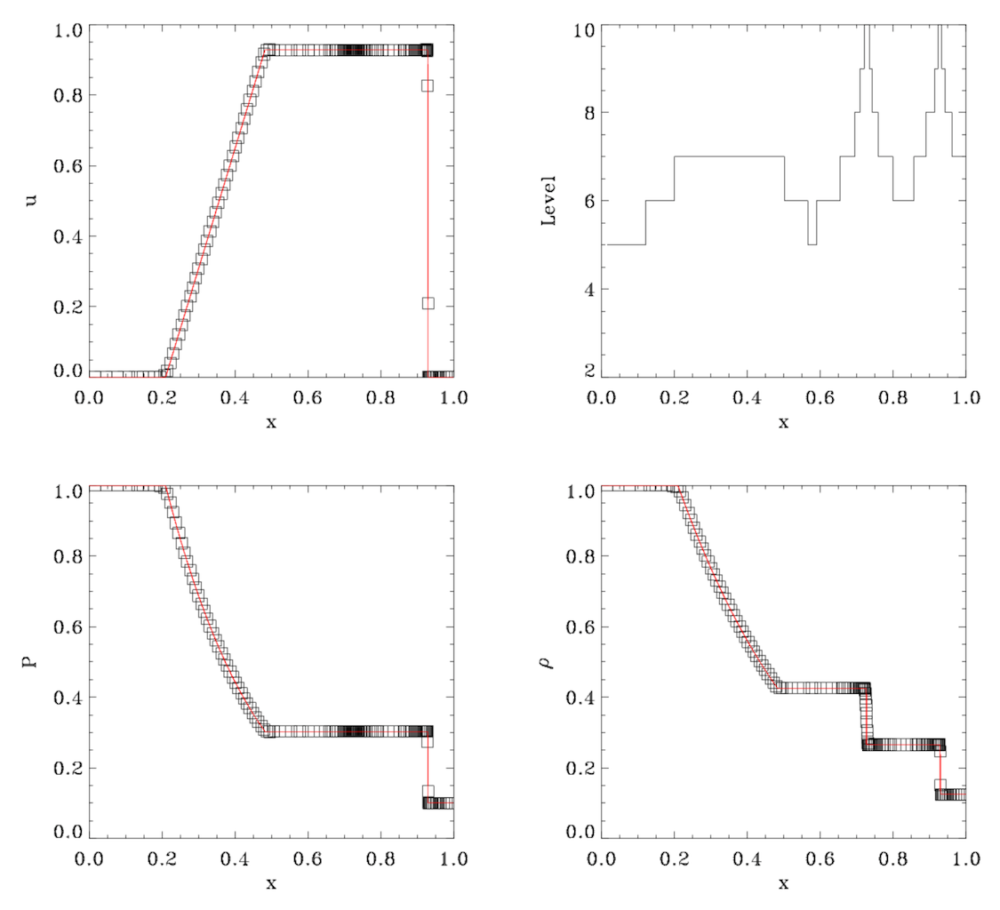

# Getting started

In this chapter,  we will explain step  by step how to  get the RAMSES
package and install it, then how to perform a simple test to check the
installation.

## Obtaining the package

The package can be downloaded from the GitHub repository using git:

```
$ git clone https://github.com/ramses-organisation/ramses
```

This will create a new repository called `ramses/`
In this directory, you will see:

```
$ ls -F
README		bin/		mhd/		patch/		rt/
amr/		doc/		namelist/	pm/		utils/
aton/		hydro/		pario/		poisson/
```

Each directory  contains a set of  files with a given  common purpose.
For example, `amr/`  contains all Fortran 90 routines  dealing with the
AMR grid  management and  MPI communications, while  `hydro/` obviously
contains  all Fortran  90  routines dealing  with hydrodynamics.   The
first directory you are interested in is the `bin/` directory, in which
the code will be compiled.


## Compiling the code

You need to go first to the `bin/`directory:
```
$ cd trunk/ramses/bin
$ ls -F
Makefile	Makefile.rt
```

We will use the first `Makefile` to compile the code.  The first thing
to do is to edit the `Makefile` and modify the two variables `F90` and
`FFLAGS`.   Several  examples   corresponding  to   different  Fortran
compilers are given. The default values are:

```
F90 = gfortran -O3 -frecord-marker=4 -fbacktrace -ffree-line-length-none
FFLAGS = -x f95-cpp-input -DWITHOUTMPI $(DEFINES)
```

The first variable is obviously the command used to invoke the Fortran
compiler.  In this  case, this is the [GNU  Fortran compiler][1].  The
second variable  contains Fortran  compilation flags  and preprocessor
directives.  The first directive, `-DWITHOUTMPI`, switches off all MPI
routines.  On  the other hand,  if you  don't use this  directive, the
code must  be linked to  the MPI library.  We will discuss  this point
later.

[1]: http://gcc.gnu.org/fortran

Other preprocessor directives are defined in variable `DEFINES` in the 
`Makefile`:

```
# Compilation time parameters
NVECTOR = 64
NDIM = 3
NPRE = 8
NVAR = 8
SOLVER = hydro
PATCH =
EXEC = ramses
DEFINES = -DNVECTOR=$(NVECTOR) -DNDIM=$(NDIM) -DNPRE=$(NPRE) -DNVAR=$(NVAR) -DSOLVER$(SOLVER)
```

These   additional    directives   are   called    _Compilation   Time
Parameters_. They should be defined  in the `Makefile` and the code must 
be recompiled entirely using:

```
$ make clean
$ make
```

We list now the definitions of these parameters.

`NVECTOR=64`
: This parameter is used   to    set   the   vector    size   for 
computation-intensive   operations.   It    must   be   determined
experimentally on each new hardware.

`NPRE=4`
: This parameter sets the precision of the floating point operations. 
`NPRE=4`stands for single precision arithmetics, while `NPRE=8` is 
for double precision.

`NENER=0`
: This parameter sets the number of energy variables used in the hydro or mhd solver.

`NDIM=3`
: This parameter sets the dimensionality of the problem.
The value `NDIM=1`is for 1D, plan-parallel flows. `NDIM=2` and 
`NDIM=3` are resp. for 2D and 3D flows.

`SOLVER=hydro`
: This parameter selects the type of hyperbolic solver used. 
Possible values are: `hydro` for the adiabatic Euler equations,
`mhd`, the Constrained Transport scheme for the ideal MHD equations.
and `rhd` for relativistic hydro.

`NVAR=8`
: This parameters defines the number of variables in the hyperbolic solver. 
For `SOLVER=hydro`, `NVAR>=NDIM+2`. 
For `SOLVER=mhd`, `NVAR>=8` and for `SOLVER=rhd`, one has `NVAR>=5`. 

Our goal is now to compile the code for a simple one-dimensional problem.
You need to modify the `Makefile` so that:

```
NDIM=1
SOLVER=hydro
NVAR=3
```

Then type:

```
$ make
```

If everything goes well, all source files will be compiled and 
linked into an executable called `ramses1d`.

### Additional compilation preprocessor flags

`-DTSC`
: This parameter sets the triangular shape cloud approximation; only works with `NDIM=3`

`-DOUTPUT_PARTICLE_POTENTIAL`
: This parameter forces the code to output particle potentials at snapshots

`-DQUADHILBERT`
: This parameter sets longer Hilbert curve necessary if `levelmax>19`

`-DLONGINT`
: This parameter switches to long ints (necessary when one has lots of particles)

`-DNOSYSTEM`
: This parameter handles operating system commands


## Executing the test case

To test the compilation, you need to execute a simple test case. Go up
one level and type the following command:

```
$ cd trunk/ramses
$ bin/ramses1d namelist/tube1d.nml
```

The first part of the command is the executable we have just compiled.
The second part, the only command line argument, is an input file 
containing the _run time parameters_. Several examples of such parameter 
files are stored in the `namelist/` directory. The namelist file we 
have just used `tube1d.nml` is the Sod test, a simple shock tube simulation 
in 1D. For comparison, we now show the last 14 lines of the standard output: 

```
 Mesh structure
 Level  1 has          1 grids (       1,       1,       1,)
 Level  2 has          2 grids (       2,       2,       2,)
 Level  3 has          4 grids (       4,       4,       4,)
 Level  4 has          8 grids (       8,       8,       8,)
 Level  5 has         16 grids (      16,      16,      16,)
 Level  6 has         27 grids (      27,      27,      27,)
 Level  7 has         37 grids (      37,      37,      37,)
 Level  8 has         17 grids (      17,      17,      17,)
 Level  9 has         16 grids (      16,      16,      16,)
 Level 10 has         13 grids (      13,      13,      13,)
 Main step=    43 mcons=-1.97E-16 econs= 1.61E-16 epot= 0.00E+00 ekin= 1.38E+00
 Fine step=   688 t= 2.45047E-01 dt= 3.561E-04 a= 1.000E+00 mem= 7.6%
 Run completed
```

If  your  execution looks  similar,  it  means your  installation  was
successfull.   Users are  encouraged to  redirect the  standard output
into  a _log  file_. This  log  file contains  all simulation  control
variables, as well as output variables, but for 1D simulations only.

```
$ bin/ramses1d namelist/tube1d.nml > tube.log
```


## Reading the log file

We  will now  briefly  describe the  structure and  the  nature of  the
information available in the log file. We will use as example the file
`tube.log` we have just created. It should contain, starting from the top:

```
 _/_/_/       _/_/     _/    _/    _/_/_/   _/_/_/_/    _/_/_/
 _/    _/    _/  _/    _/_/_/_/   _/    _/  _/         _/    _/
 _/    _/   _/    _/   _/ _/ _/   _/        _/         _/
 _/_/_/     _/_/_/_/   _/    _/     _/_/    _/_/_/       _/_/
 _/    _/   _/    _/   _/    _/         _/  _/               _/
 _/    _/   _/    _/   _/    _/   _/    _/  _/         _/    _/
 _/    _/   _/    _/   _/    _/    _/_/_/   _/_/_/_/    _/_/_/
                         Version 3.0
        written by Romain Teyssier (CEA/DSM/IRFU/SAP)
                      (c) CEA 1999-2007

 Working with nproc =    1 for ndim = 1
 Using the hydro solver with nvar =  3

 Building initial AMR grid
 Initial mesh structure
 Level  1 has          1 grids (       1,       1,       1,)
 Level  2 has          2 grids (       2,       2,       2,)
 Level  3 has          4 grids (       4,       4,       4,)
 Level  4 has          8 grids (       8,       8,       8,)
 Level  5 has          8 grids (       8,       8,       8,)
 Level  6 has          8 grids (       8,       8,       8,)
 Level  7 has          8 grids (       8,       8,       8,)
 Level  8 has          8 grids (       8,       8,       8,)
 Level  9 has          6 grids (       6,       6,       6,)
 Level 10 has          4 grids (       4,       4,       4,)
 Starting time integration
 Output    58 cells
 ================================================
 lev      x           d          u          P
  4  3.12500E-02  1.000E+00  0.000E+00  1.000E+00
  4  9.37500E-02  1.000E+00  0.000E+00  1.000E+00
...
  4  9.06250E-01  1.250E-01  0.000E+00  1.000E-01
  4  9.68750E-01  1.250E-01  0.000E+00  1.000E-01
 ================================================
 Fine step=     0 t= 0.00000E+00 dt= 6.603E-04 a= 1.000E+00 mem= 3.2%
 Fine step=     1 t= 6.60250E-04 dt= 4.420E-04 a= 1.000E+00 mem= 3.2%
```

After the  code banner and  copyrights, the first line  indicates that
you are  currently using 1  processor and  1 space dimension  for this
run.   The second  line confirms  the solver  used and  the number  of
variables  defined for  this run.  The code  then reports  that it  is
building the initial AMR grid. The  next lines give the resulting mesh
structure.

The first level of refinement in _ramses_ covers the whole computational 
domain with 2 (resp. 4 and 8) cells in 1 (resp. 2 and 3) space dimension.
The grid is then entirely refined up to `levelmin`, which in this case is
defined in the parameter file to be `levelmin=3`. This defines the 
_coarse grid_. The grid is then adaptively refined up to `levelmax`, which 
in this case `levelmax=10`. Each line in the log file indicates the 
number of octs (or grids) at each level of refinement. The maximum number
of grids in each level `level` is equal to `2**(level-1)` for `NDIM=1`,
to `4**(level-1)` for `NDIM=2` and to `8**(level-1)` for `NDIM=3`.

The numbers inside parentheses give the minimum, maximum and average 
number of grids per processor. This is obviously only relevant to 
parallel runs.

The code then indicates that the  time integration starts. After outputting
the initial  conditions to screen,  the first _control  line_ appears,
starting  with  the  words  `Fine   step=`.  The  control  line  gives
information on each _fine step_,  its current number, its current time
coordinate, its current time step.  Variable `a` is for cosmology runs
only and gives the current expansion factor.  The last variable is the
percentage of allocated memory currently  used by ramses to store each
flow variable on the grid.

In ramses,  adaptive time  stepping is  implemented, which  results in
defining _coarse steps_  and _fine steps_. Coarse  steps correspond to
the coarse grid, which is  defined by variable `levelmin`.  Fine steps
correspond  to  finer  levels,  for  which  the  time  step  has  been
recursively subdivided by  a factor of 2. Fine  levels are sub-cycled,
twice as more as their parent  coarse level. This explains why, at the
end of the log file, only 43 coarse steps are reported (1 through 43),
for 689 fine steps (numbered from 0 to 688).

When a  coarse step is  reached, the code writes  in the log  file the
current mesh  structure.  A  new control  line then  appears, starting
with the  words `Main step=`.  This control line gives  information on
each coarse step, namely its current number, the current error in mass
conservation within the computational  box `mcons=`, the current error
in  total energy  conservation `econs=`,  the gravitational  potential
energy and the fluid total energy (kinetic plus thermal).

This constitutes the  basic information contained in the  log file. In
1D simulations, output  data are also written to  standard output, and
thus to  the log  file. For  2D and  3D, output  data are  stored into
unformatted    Fortran    binary    files    (named    `output_00001`,
`output_00002`...).  In  our example,  the fluid variables  are listed
using 5 columns:  level of refinement, position of  the cell, density,
velocity and pressure:

```
 Output   142 cells
 ================================================
 lev      x           d          u          P
  5  1.56250E-02  1.000E+00  0.000E+00  1.000E+00
  5  4.68750E-02  1.000E+00  0.000E+00  1.000E+00
  5  7.81250E-02  1.000E+00  0.000E+00  1.000E+00
  5  1.09375E-01  1.000E+00  1.564E-09  1.000E+00
  6  1.32812E-01  1.000E+00  2.112E-08  1.000E+00
```

You can  cut and paste  the 142 lines into  another file and  use your
favorite  data viewer  like `xmgrace`  or `gnuplot`  to visualize  the
results.  These should be compared to  the plots shown on the figure below. If
you  have   obtained  comparable   numerical  values  and   levels  of
refinements,  your  installation  is  likely  to  be  valid.  You  are
encouraged to  edit the  parameter file  `tube1d.nml` and  play around
with   other   parameter  values,   in   order   to  test   the   code
performances.  You  can   also  use  other  parameter   files  in  the
`namelist/` directory

If you would like to run a 2D simulation (using file `sedov2d.nml` for 
example), do not forget to recompile entirely the code using:

```
$ cd trunk/ramses/bin
$ make clean
$ make NDIM=2
```

This last image shows the numerical results obtained with ramses for the Sod shock tube test (symbols) compared to the analytical solution (red line).

